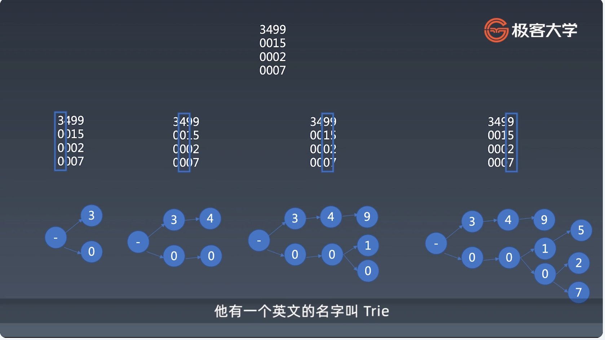
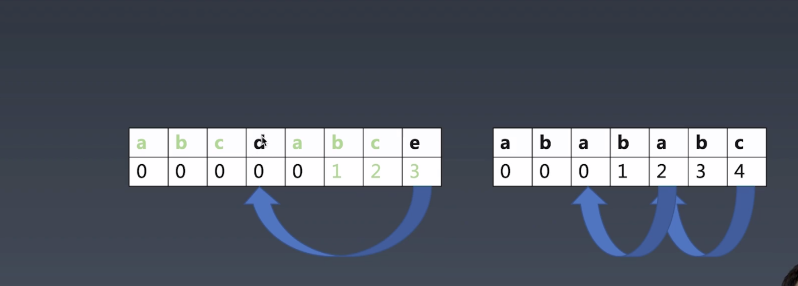

学习笔记

字典树:
    查找字符串

    3499
    0015
    0002
    0007

KMP算法:
    时间复杂度:m+n

    pattern: abcdabce
    source: abcdabcdabce
暴力解法:
    

   
  

查找重复子串:

 

跳转表格:

   

wildcard算法:

    1. 前面的*尽量少匹配
    2. 最后一个*尽量多匹配
    3. 先找总共多少个*
    4. 匹配第一个*之前的串
    5. 正则匹配中间的*的串
    6. 匹配最后一个*之后的串
    7. 如果都匹配,则说明找到了

