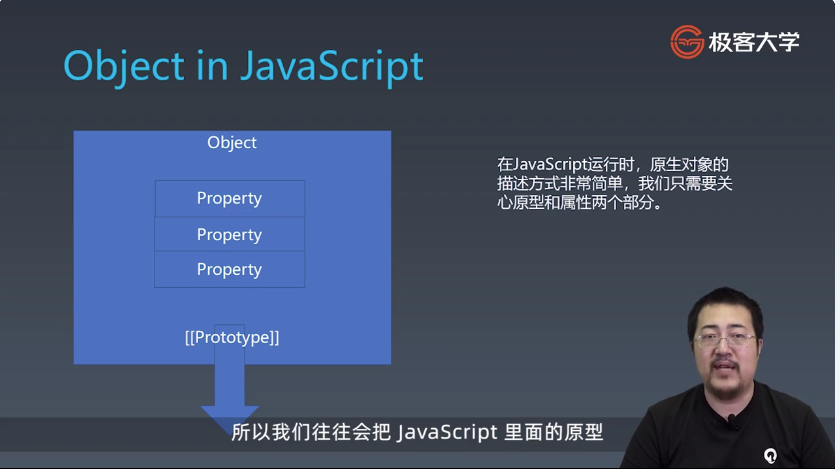

学习笔记

语言分类:

声明式:

```
JSON HTML xaml sql css lisp clojure haskell
```

命令式语言:

```
C C++ JAVA C# PYTHON Ruby Perl JavaScript Objective-C,Coffee
```

### 乔姆斯基谱系：

``` 
是计算机科学中刻画形式文法表达能力的一个分类谱系，是由诺姆·乔姆斯基于 1956 年提出的。它包括四个层次：


0- 型文法（无限制文法或短语结构文法）包括所有的文法。
1- 型文法（上下文相关文法）生成上下文相关语言。
2- 型文法（上下文无关文法）生成上下文无关语言。
3- 型文法（正规文法）生成正则语言。
```

### 巴科斯诺尔范式：

``` 
即巴科斯范式（英语：Backus Normal Form，缩写为 BNF）是一种用于表示上下文无关文法的语言，上下文无关文法描述了一类形式语言。它是由约翰·巴科斯（John Backus）和彼得·诺尔（Peter Naur）首先引入的用来描述计算机语言语法的符号集。

```

### 1. 图灵完备性：

在可计算性理论里，如果一系列操作数据的规则（如指令集、编程语言、细胞自动机）可以用来模拟单带图灵机，那么它是图灵完全的。这个词源于引入图灵机概念的数学家艾伦·图灵。虽然图灵机会受到储存能力的物理限制，图灵完全性通常指“具有无限存储能力的通用物理机器或编程语言”。

### 2. 图灵机（Turing machine）：

``` 
又称确定型图灵机，是英国数学家艾伦·图灵于 1936 年提出的一种将人的计算行为抽象掉的数学逻辑机，其更抽象的意义为一种计算模型，可以看作等价于任何有限逻辑数学过程的终极强大逻辑机器。
```
### 3. 静态和动态语言： 

https://www.cnblogs.com/raind/p/8551791.html

### 4. 强类型： 无隐式转换

### 5. 弱类型： 有隐式转换

### 6. 协变与逆变：

 https://jkchao.github.io/typescript-book-chinese/tips/covarianceAndContravariance.html


 ### 类型系统:

 . 动态类型系统与静态类型系统

 . 强类型与弱类型

 . 复合类型:

    结构体
    函数签名

 .字类型

 .泛型

 一般命令式编程语言的设计方式:

 

 数据类型:

  

  typeof null === 'object', javascript 的bug


  ### String:


### 字符集:

ASCII: 127个字符,无中文字符

Unicode:国际字符集 ,包含中文字符

ucs:0000-ffff

GB:
    ```
    gb2312
    gbk(gb13000)
    gb18030
    ```

ISO-8859:东欧,不是一个统一标准

BIG5:台湾

编码:


产生undefined值可以用void 0来代替

### Object:

三个核心要素：唯一性，状态，行为





Array: 具有自动计算长度的对象集合。
Function: 具有方法和执行能力的对象。
Arguments: 函数内具有实体的形参。
Map: 引用地址为key的对象。
Set: 自动去重的Array对象集合。
Navigator:navigator对象是识别客户端浏览器的标准,每个浏览器中的navigator对象有一套自己的属性

Screen: screen对象只用来表明客户端能力,包括浏览器窗口外部的显示器信息

History:history对象保存用户上网的历史记录,从窗口打开的那一刻起,但是需要注意的是history是window对象的属性,因此每个浏览器窗口,每个标签页乃至每个框架,都有自己的history对象与特定的window对象关联

Date:事件相关的

