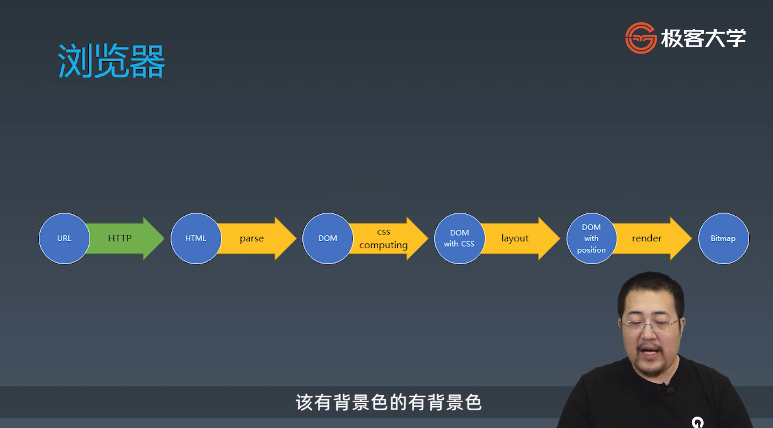
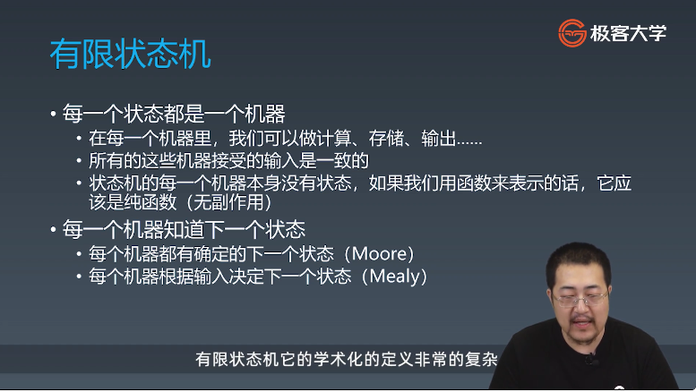
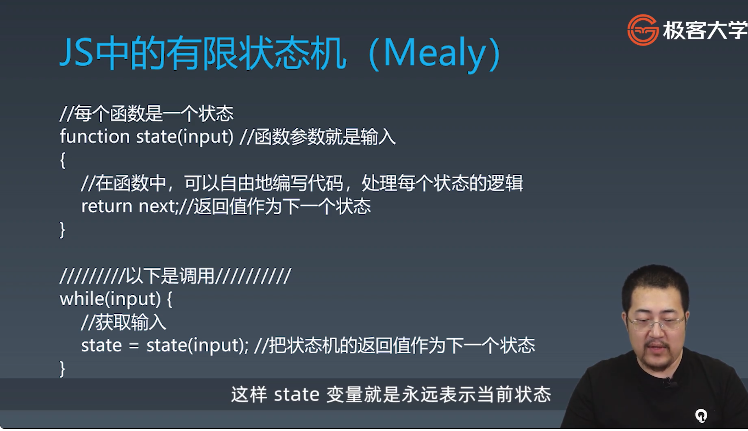
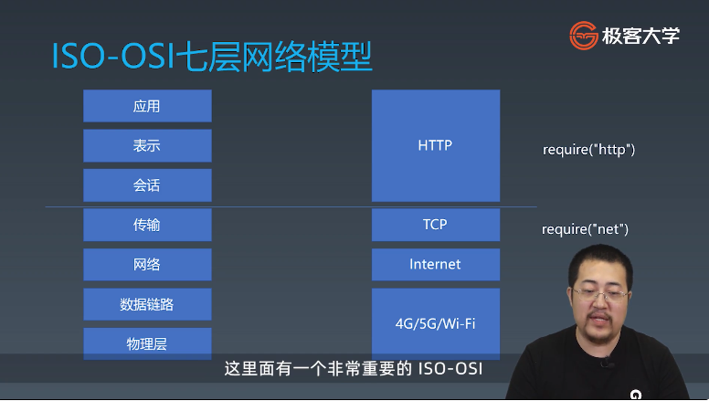
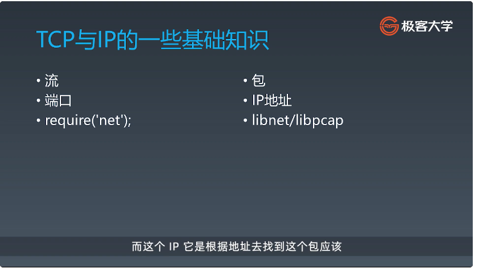
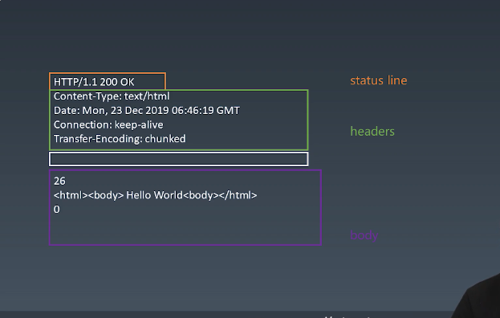

# 浏览器工作原理:

## 浏览器总论

URL->http->html->parse->dom->css computing->dom with css-->Bitmap



## 状态机

1. 有限状态机




2. 不使用状态机处理字符串 [findA.js] [findAB.js] [findABCDEF.js]

3. 使用状态机处理字符串,[match.js] [findABCABX.js] [findABABABX.js]

4. HTTP请求 | HTTP的协议解析


TCP与IP的一些基础知识:


5. 服务端:[server.js]
6. 客户端:[client.js]
7. reponse格式:



# | 不适用状态机处理字符串

## ||  使用有限状态机处理字符串
### ||| 在一个字符串中，找到字符 a

```javascript
function match(str) {
    for (let c of str) {
        if (c === 'a') return true;
    }
    return false;
}
```
时间复杂度O(n)

### ||| 在一个字符串中，找到连续的字符 ab
```javascript
function match(str) {
    let foundA = false;
    for (let char of str) {
        if (char === 'a')
            foundA = true;
        else if (char === 'b' && foundA)
            return true;
        else
            foundA = false;
    }
    return false;
}
```
### ||| 在一个字符串中，找到字符 'abcdef'
```javascript
function match(str) {
    let foundA = 0;
    let foundB = 0;
    let foundC = 0;
    let foundD = 0;
    let foundE = 0;
    for (let char of str) {
        if (char === 'a')
            foundA++;
        else if (foundA === 1 && char ==='b')
            foundB++;
        else if (foundB === 1 && char === 'c')
            foundC++;
        else if (foundC === 1 && char === 'd')
            foundD++;
        else if (foundD === 1 && char === 'e')
            foundE++;
        else if (foundE === 1 && char === 'f')
            return true;
        else {
            foundA = 0;
            foundB = 0;
            foundC = 0;
            foundD = 0;
            foundE = 0;
        }
            
    }
    return false;
}
```

## || 使用状态机处理字符串
```javascript

function match(string) {
    let state = start;
    for (let c of string) {
        state = state(c)
    }
    return state === end;
}
function start(c) {
    if (c === 'a')
        return foundA;
    else
        return start;
}

function end(c) {
    return end;
}

function foundA(c) {
    if (c === 'b')
        return foundB;
    else
        return start(c);
}

function foundB(c) {
    if (c === 'c')
        return foundC;
    else
        return start(c);
}

function foundC(c) {
    if (c === 'd')
        return foundD;
    else
        return start(c);
}

function foundD(c) {
    if (c === 'e')
        return foundE;
    else
        return start(c);
}

function foundE(c) {
    if (c === 'f')
        return end;
    else
        return start(c);
}
```
* 陷阱，一直在 end
* reconsume，start 再传入 c

### ||| 用状态机处理 "abcabx" 这样的字符串
```javascript
function match(string) {
    let state = start;
    for (let c of string) {
        state = state(c)
    }
    return state === end;
}
function start(c) {
    if (c === 'a')
        return foundA;
    else
        return start;
}

function end(c) {
    return end;
}

function foundA(c) {
    if (c === 'b')
        return foundB;
    else
        return start(c);
}

function foundB(c) {
    if (c === 'c')
        return foundC;
    else
        return start(c);
}

function foundC(c) {
    if (c === 'a')
        return foundA2;
    else
        return start(c);
}

function foundA2(c) {
    if (c === 'b')
        return foundB2;
    else
        return start(c);
}

function foundB2(c) {
    if (c === 'x') {
        return end;
    } else {
        return foundB(c);
    }
}

console.log(match('abcabcabx'));
```

abcabcabx，第二个abc 的时候，将 'c' 传给了 foundB 状态

### ||| 使用状态机处理 'abababx'

```javascript
function match(string) {
    let state = start;
    for (let c of string) {
        state = state(c)
    }
    return state === end;
}

function start(c) {
    if (c === 'a')
        return foundA;
    else
        return start;
}

function end(c) {
    return end;
}

function foundA(c) {
    if (c === 'b')
        return foundB;
    else
        return start(c);
}

function foundB(c) {
    if (c === 'a')
        return foundA2;
    else
        return start(c);
}

function foundA2(c) {
    if (c === 'b')
        return foundB2;
    else
        return start(c);
}

function foundB2(c) {
    if (c === 'a')
        return foundA3;
    else
        return foundB(c);
}

function foundA3(c) {
    if (c === 'b')
        return foundB2;
    else
        return start(c);
}

function foundB3(c) {
    if (c === 'x')
        return end;
    else
        return foundB2(c);
}

console.log(match('abababx'));
```


# 实现 HTTP 请求
## ||  ISO-OSI 七层网络模型
* 应用
* 表示
* 会话
* 传输
    * 包含 TCP、UDP
* 网络
    * 包含 IP 协议，internet protocol
* 数据链路
* 物理层


数据层和物理层解决点对点传输的问题

在 Node.js 中：
* TCP => require('net')
* 会话、表示、应用 => HTTP => require('http')

## ||  TCP 与 IP 的一些基础知识
* 流
* 端口，哪一个数据分配给那个软件，用端口来确定
* require('net')
* 包，TCP 传输的数据是一个一个的包
* IP 地址，包需要从哪儿到哪儿
    * 小区节点 => 电信主干网 => 国际主干线
* libnet/libpcap
    * libnet 构造 ip 包并且发送
    * libpcap，从网卡，抓去流经网卡的所有包，可以通过某些抓到不是发给自己的包

## || HTTP
* TCP 全双工
* HTTP 必须先由客户端发送 request，再由服务端相应 response，每个 request 对应一个 response
* HTTP 协议是文本型协议，不是二进制协议，不是传二进制编码，而是传 unicode 编码
* 所有 HTTP 的换行都是 \r \n 两个字符构成

HTTP 的例子
```
POST / HTTP/1.1
Host: 127.0.0.1
Content_Type: application/x-www-form-urlencoded

field=aaa&code=x%3D1
```

* 第一行，Request line
    * 方法
    * 路径，path，默认 `/`
    * 协议
* 第二行，第三行， headers，kv
* 第五行，body 部分，根据 Content-Type 来决定格式

## || 实现 HTTP 请求
### ||| 第一步：构造 Http 请求
* 谁将一个 HTTP 请求的类
* Content-Type 是一个必要字段，设置默认值
* body 是 KV 格式
* 不同的 Content-Type 影响 body 的格式

### ||| 第二步 send 函数的总结
* 在 Request 的构造器中收集必要的信息
* 设计一个 send 函数，将请求真是发送到服务器
* send 函数应该是异步的，返回 Promise

response格式  

```
HTTP/1.1 200 /* status line*/
Content-Type:text/html /* headers */
Date:Mon,23 Dec 2019 06:46:19 GMT /* headers */
Connection: keep-alive /* headers */
Transfer-Encoding: chunked /* headers */

26 /* chunked body, 16 进制数字 */
<html><body>Hello world</body></html> /* chunked body */
0 /* chunked body, 16 进制数字 */
```

### ||| 第三步 发送请求
* 支持已有的 connection，否则新建 connection
* 收到数据传给 parser 解析
* 根据 parser 的状态去设定 Promise 的状态

### ||| 第四步 ResponseParser 总结
* Response 必须分段构造，所以用了一个 ResponseParser 来装配
* ResponseParser 分段处理 ResponseText，使用状态机来分析文本结构

### ||| 第五步 BodyParser 总结
* Response 的 body 可能根据 Content-Type 有不同的结构，因此会采用不同的子 Parser 来解决问题
* 文中以 TrunkedBodyParser 为例，我们同样用状态机来处理 body 的格式
* \r表示回车 \n表示换行(新起一行)


学习笔记
#### 浏览器的基础渲染流程
1. 输入URL，发送HTTP请求，解析HTTP回应，获得HTML（HTTP）
2. 对HTML进行解析，生成DOM树（parse）
3. 进行css属性计算，得到带样式的DOM树(css computing)
4. 进行布局，计算每个元素的位置（layout）
5. 渲染，把DOM树画到一张图片（Btimap）上，然后通过操作系统和硬件驱动提供的API接口，展示到屏幕上（render）

#### 有限状态机
+ 每一个状态都是一个机器
    - 在每一个机器里，我们可以做计算、存储、输出...
    - 所有的这些机器接受的输入是一致的
    - 状态机的每一个机器本身没有状态，如果我们用函数来表示的话，它应该是纯函数
+ 每一个机器知道下一个状态(两种)
    1. 每个机器都有确定的下一个状态（Moore型）
    2. 每个机器根据输入决定下一个状态（Mealy型）**实用**

    ##### JS中的有限状态机（Mealy型）

    ```js
    //每个函数是一个状态
    function state(input){
        //在函数中，可以自由的编写代码，处理每个状态的逻辑
        return next;//返回值作为下一个状态
    }
    <!-- 调用 -->
    while(input){
        //获取输入
        state = state(input);//把状态机的返回值作为下一个状态
    }
    ```

    使用状态机处理字符串(找到字符abcdef)
    ```js
    console.log(match('i love abcdefg'))
    function match(str){
        let state = start;
        for(let c  of str){
           state = state(c);
        }
        return state === end;//最终状态函数为end，表示已匹配结束
    }
    function start(c){
        if(c === 'a'){
            return foundA;
        } else{
            return start;
        }
    }
    function foundA(c){
        if(c === 'b'){
            return foundB;
        }else{
            return start(c);//reConsume（重新使用）
        }
    }
    function foundB(c){
        if(c === 'c'){
            return foundC;
        }else{
            return start(c);
        }
    }
    function foundC(c){
        if(c === 'd'){
            return foundD
        }else{
            return start(c);
        }
    }
    function foundD(c){
        if(c === 'e'){
            return foundE;
        }else{
            return start(c)
        }
    }
    function foundE(c){
        if(c === 'f'){
            return end;
        }else{
            return start(c);
        }
    }
    function end(c){
        return end;
    }
    ```
#### 了解HTTP协议
+ 文本型协议（所有内容都是字符串）
+ HTTP request构成：
    request line（请求行）：`POST / HTTP/1.1`
    - method (POST/GET/DELETE...)
    - path（路径）默认为/
    - 版本 如：HTTP/1.1
    
    headers（请求头）
        - 包含多行，每一行是以冒号分割的`key:value`键值对 
        - 行数不固定，以一个空白行为结束标志

    body（请求体）
        - 格式由headers的Content-Type来决定格式
+ HTTP请求中所有换行都是以`\r\n`两个字符组成的
+ HTTP response构成：
    status line：` HTTP/1.1 200 OK`
    - 版本号，如：HTTP/1.1
    - 状态码，如：200
    - 状态文本，如：OK

    headers
    - 格式与request一致

    body
    - 格式由headers的Content-Type来决定格式
    - 一种典型的格式：chunked body（node默认返回的）
        十六进制的数字单独占一行，后面跟着内容部分，后面又跟着一个十六进制的数字，代表内容的长度，直到最后有一个十六进制的0，会得到空的chunk，0之后就是整个body的结尾了

#### 实现一个HTTP请求
第一步
+ 设计一个HTTP请求的类
+ content-type是一个必要字段，要有默认值
+ body是键值对格式
+ 不同的content-type影响body的格式

第二步 send函数总结
+ 在Request的构造器中收集必要的信息
+ 设计一个send函数，把请求真实发送到服务器
+ send函数应该是异步的，所以返回Promise

第三步 发送请求
+ 设计支持已有的connection或者自己新建connection
+ 收到数据传给parser
+ 根据parser的状态resolve Promise

第四步 Response解析
+ Response必须分段构造，所以我们要用一个ResponseParser来装配
+ ResponseParser分段处理ResponseText，用状态机来分析文本结构\

第五步 BodyParser总结
+ Response的body可能根据Content-Type有不同的结构，因此我们会采用子Parser的结构来解决问题
+ 以TrunkedBodyParser为例（还有很多其他类型的parser），我们同样使用状态机来处理body的格式


