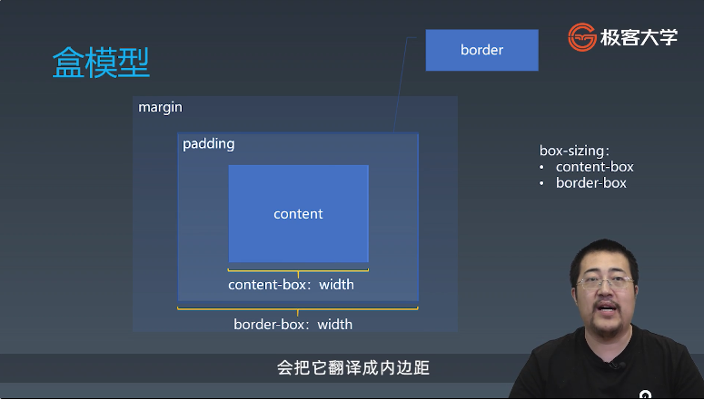
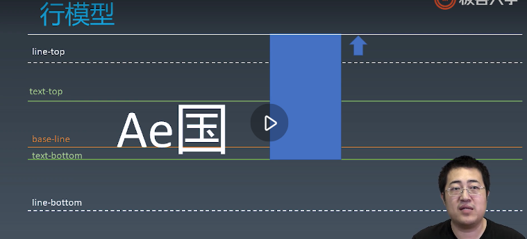
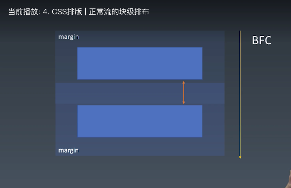
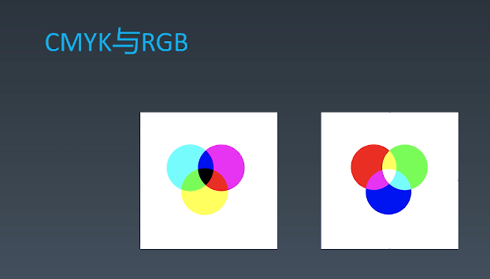
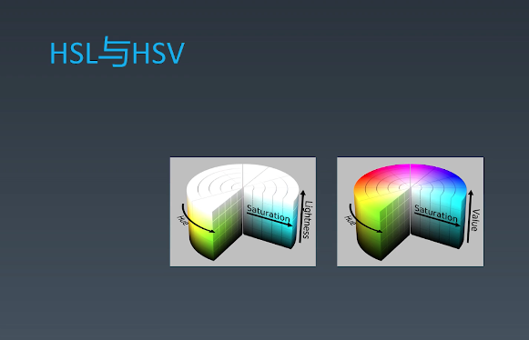

学习笔记

##### 盒
HTML代码中可以书写开始_标签___，结束__标签__ ，和自封闭__标签__ 。

一对起止_标签___ ，表示一个__元素__ 。

DOM树中存储的是元素____和其它类型的节点（Node）。

CSS选择器选中的是__元素__ 。

CSS选择器选中的_元素___ ，在排版时可能产生多个__盒__ 。

排版和渲染的基本单位是_盒___ 。

##### 1. 盒模型

##### 2. 正常流
+ 收集盒进行
+ 计算盒在行中的排布
+ 计算行的排布
+ IFC: 行
+ BFC: 纵向排布

##### 3. 正常流的行级排布

+ Baseline : 以文字排布的基线对齐 line.html

##### 4. CSS排版 | 正常流的块级排布
+ float: 会发生重拍:float3.html
+ margin collapse: 只有BFC才会发生 margin.html

##### BFC合并

###### Block
+ Block Container: 里面有BFC的
    + 能容纳正常流的盒,里面就有BFC,想象有哪些
+ Block Level Box: 外面有BFC
+ Block Box = Block Container + Block Level Box: 里外都有BFC的

###### Block Container

+ block
+ inline-block
+ table-cell
+ flex items
+ grid cell
+ table-caption

###### Block Level Box
+ display:block
+ display:flex
+ display:table
+ display:grid
+ ...

inline level

+ display:inline-block
+ display:inline-flex
+ display:inline-table
+ display:inline-grid
+ ...

#### 设立BFC
+ floats, 具有float
+ absolute postioned elements
+ block containers(such as inline-blocks,table-cells, and table-captions) that are not block boxes
    + flex-items
    + grid cell

+ and blocks with 'overflow' other than 'visible'

#### 5. BFC 合并

+ block box && overflow:visible
    + BFC合并与float bfc1.html 
    + BFC合并与边距折叠 bfc2.html 

#### 6. Flex 排版

#### 7. CSS动画与绘制
+ @keyframe animation.html
+ 贝塞尔曲线: cubic-bezier.com

#### 8. CSS动画与绘制 | 颜色
+ CMYK与RGB

+ HSL与HSV

#### 8. CSS动画与绘制 | 绘制

+ 几何图形
    + border
    + box-shadow
    + border-radius

+ 文字
    + font
    + text-decoration

+ 位图
    + background-image

##### 应用技巧

+ data uri + svg
+ data:image/svg+xml,<svg xmlns="http://www.w3.org/2000/svg" version="1.1">
  <ellipse cx="300" cy="80" rx="100" ry="50"
  style="fill:yellow;stroke:purple;stroke-width:2"/>
</svg>
