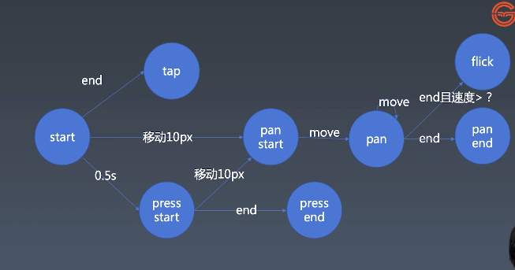

学习笔记学习笔记

#### Animation 的方式

**实现方式**
+ setInterval 1s/60帧= 16ms  容易造成积压
+ tick setTimeout 推荐
    ```
    let tick = () => {
        setTimeout(tick,16)
    }
    ```
+ requestAnimationFrame 推荐 cancelAnimationFrame

    ```
    let tick = () => {
        requestAnimationFrame(tick)
    }
    ```

+ 实现class的私有方法,使用Symbol,唯一性

#### Gesture 的基本知识


**PC 鼠标实现**
+ mousedown
+ mousemove
+ mouseup

**移动设备首饰实现**
+ touchstart
+ touchmove
+ touchend
+ touchscancel


